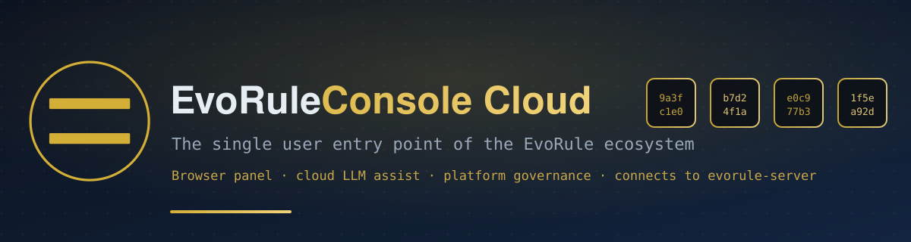

<!-- SPDX-License-Identifier: AGPL-3.0-or-later -->
<!-- Copyright (C) 2026 EvoRule Project -->



<div align="center">

# EvoRule Console Cloud

**evorule rule-engine console · the connected public edition** — a professional starting point for secondary developers (core engine + connectivity + cloud LLM + platform governance)

[](./CHANGELOG.md)
[](./LICENSE)
[](https://gitee.com/evorule/evorule-console)

**Language / 语言**: [English](#english) · [中文 / Chinese](#chinese)

</div>

---

<a id="english"></a>

## Quick Start for New Users

- **[5-Minute Quick Start (Developer Path)](./docs/tutorial/01-quickstart.md)** — clone the repo + dev environment, go from 0 to your first running rule
- **[❓ In-browser Help Page](http://127.0.0.1:5174/help)** — the "❓ Help" button at the bottom of the sidebar after the service starts
- **[One-Click Start/Stop Guide](./README-STARTUP.md)** — both desktop double-click and command-line methods

---

## For Decision Makers (30-Second Read)

> evorule is the **compliance & audit layer** for AI Agents — making every decision of an AI Agent auditable, replayable, and rollable-back.

### Why evorule?

| Pain Point | evorule's Answer |
| --- | --- |
| AI Agent decisions are opaque | BLAKE3 hash-chain — every decision is tamper-evident and traceable |
| Can't locate root cause when something breaks | Time-travel replay + causal-chain analysis, locate in seconds |
| Compliance audits are hard to pass | Audit export satisfies EU AI Act Article 12 + China MLPS 2.0 Level 3 |
| Rule publishing has no controls | Three-tier permission approval + rolling session hot-reload with zero downtime |

### Position in the Ecosystem

| Repo | Role |
| --- | --- |
| [evorule](https://gitee.com/evorule/evorule) | Core engine (TCB / Reactor / Governance, on crates.io) |
| [evorule-server](https://gitee.com/evorule/evorule-server) | HTTP server (auth / audit / plugins / template marketplace) |
| **This repo** | The single user entry point (browser console, professional starting point for secondary developers) |
| [Online demo](https://evorule.github.io/evorule-console-cloud/) | No registration needed — medical + finance scenarios, in-browser MockBackend with zero network dependency |

### 4 Guided Tasks (experience the full chain in 2–3 minutes)

1. **Add a rule** (2 min): add a hospital rule "patients over 65 with fever must get a CT first"
2. **Find a problem** (1 min): locate why patient P-1283 triggered an anomaly alert
3. **Edit a rule** (3 min): change the fever threshold from 38°C to 37.5°C
4. **Compliance gate** (2 min): an AI Agent calls a transfer without MFA → gate blocks it + BLAKE3 leaves a trail

### Scenario Example Rules (real business semantics, reproducible)

- **[Contract Payment Guard](./docs/scenarios/01-contract-payment-guard.md)** — blocks when payment prerequisites are missing
- **[Expense Compliance Check](./docs/scenarios/02-expense-compliance.md)** — rejects duplicate invoices; escalates over-limit to approval chain
- **[Equipment Inspection Alert](./docs/scenarios/03-equipment-inspection.md)** — threshold-linked alerting and escalation
- **[AI Compliance Gate](./docs/scenarios/04-ai-mfa-gate.md)** — AI Agent initiates a transfer without MFA → blocked and logged

Each rule ships with two sets of contrast inputs and field-by-field expected outputs — reproduce one in 3 minutes. See [Scenario Examples Overview](./docs/scenarios/README.md).

### Core Capabilities

- **BLAKE3 tamper-evident audit chain**: every Fact is hash-linked; any tampering is detected
- **Time-travel replay**: rewind to any version, diff comparison + causal-chain tracing
- **MLPS 2.0 Level-3 gate**: compliance check before AI Agent tool calls (§8.1.4.1.d MFA / §8.1.4.7.b encryption)
- **Compliance report export**: 6 content types × 4 formats (JSON/CSV/XML/PDF); PDF prefers server-side rendering (`POST /api/export/pdf`), auto-degrades to browser print when the server doesn't support it
- **Rolling session hot-reload**: rule-set publishing with zero downtime, monotonic version increments
- **Platform auth & multi-user governance**: login / profile / user management / role-permission matrix / `can()` permission judgment moved server-side
- **Governance Center**: connects directly to the evorule-rule asset library (:18081), entry 5-state lifecycle (Draft→Candidate→Active→Published→Rejected) + version chain + online knowledge-entry editing
- **Template marketplace**: template upload / online edit / download
- **Collaborative approval workflow**: three-tier permissions (admin/lead/auditor), rule publishing requires approval

---

## Positioning

evorule-console-cloud is the **single user entry point of the entire evorule ecosystem**: every browser-user operation on evorule — rule library, execution, audit, replay, approval — converges in this console. At the same time it is also a professional starting-point tool for **secondary developers**: developers build their own products on top of this repo (different products, same starting point).

| Layer | Repo | Positioning | LLM | Network | Kernel relation |
| --- | --- | --- | --- | --- | --- |
| evorule-console (kernel) | standalone | rule-engine console kernel — execution only, no intelligence | ❌ none | ❌ none (local HTTP only) | 0 (consumes evorule core) |
| **evorule-console-cloud (this repo)** | standalone | professional starting point for secondary developers | cloud LLM | ✅ connected | kernel snapshot inlined (`src/lib/kernel/`), no npm dependency |
| Advanced edition | standalone | confidential-industry customization | local GPU LLM | ✅ connected / Tauri | kernel snapshot inlined |

This repo and the kernel repo each have independent semver. The kernel is inlined as a **source snapshot** in `src/lib/kernel/`; this repo evolves independently; the kernel repo remains the upstream reference, and subsequent snapshot syncs are done manually on demand.

---

## Version Capability Boundaries

### v0.4.1 released (2026-09-06)

- **Unauthenticated-access redirect fix**: when accessing marketplace / runtime / workspace / export / import-export / view pages without logging in, users are now uniformly redirected to the login page (previously silently bounced to the home page, easily mistaken for "page broken"); page reachability after login is unchanged

### v0.4.0 released (2026-09-06)

- **Test workbench**: rule dry-run + structured deployment-evidence stream (verify rule behavior before deployment)
- **Knowledge data plane**: `/knowledge` route + governance-center online knowledge-entry editing (Draft edit/delete + new version chain)
- **Permission management UI**: permission-entry lifecycle + judgment test bench
- **Template marketplace server wiring**: user templates use the server as single source of truth + template online-edit UI
- **PDF server-side render wiring**: Bearer-auth passthrough + explicit on-screen degradation reason
- **15 governance/execution API wirings**: audit import / session derivation / reap / payload injection / shared facts, executor stop / interrupt, rule pre-check, sandbox report, deployment provenance, execution-domain rules, queue detail, session list, member add/remove, service list, etc.
- **Platform-user integration**: platform users connected to workspace members (idempotent auto-join + explicit 403 retry)
- **"Deploy to execution domain"**: governance dataset → execution-domain publishing-chain export UI
- **Regulation-anchor edit channel**: in-product fix path for publishing-gate issues
- **Category-label management**: drawer-style management + Escape keyboard close channel
- **Scenario example rules v2**: business-instruction paradigm + in-repo rules pre-seeded (4 rules, 9 cases, all passing)
- **Rule-edit form deepening** + validator aligned to authoritative schema; journey usability cleanup + new-user experience fixes
- Full details in [CHANGELOG](CHANGELOG.md)

### v0.2.0 released (2026-09-02)

- Rule-library view usable offline (built-in demo dataset + 4 guided tasks)
- Executor / state / audit / time-travel: connect to evorule-server to run (local / remote addresses supported)
- **Platform-login integration** (server unified auth) + profile + server-side permission judgment; user-management / role-management pages (permission-matrix editor)
- Overview Dashboard (widget-registry-based); navigation registry-based (sidebar / jump-card / command-palette share one manifest and one gate)
- Historical-session audit-archive panel + platform-auth event panel
- Cloud LLM assist, three uses: create rule drafts / explain rules / generate test inputs (9 vendor presets)
- Online-mode switch (offline ↔ online), view selection, network & LLM config persistence
- apiKey security: stored only in browser localStorage, never in URL / logs / error messages

### Roadmap (planned, not promised)

| Goal | Version | Notes |
| --- | --- | --- |
| Local LLM (L2) | later | paid extension, local GPU LLM |
| Ongoing optimization | continuous | refine UI / features / docs per community feedback |

> Version semantics: `0.x` is the pre-release series; `v1.0.0` corresponds to feature-complete. Feedback and defects are welcome via [Issues](https://gitee.com/evorule/evorule-console-cloud/issues).

---

## Kernel Snapshot

This repo does not depend on the kernel via npm. The kernel's (evorule-console v0.2.0) actual dependency closure is inlined as a source snapshot in `src/lib/kernel/`:

- Entry: `src/lib/kernel/index.ts` (export surface aligned with the kernel package, omitting unused modules)
- Contents: backend abstractions & types, rules/session/audit/view stores, AssistantProvider extension slot, RuleValidator, executor/state/audit/time-travel views & ttd components
- Boundary: after the snapshot, it evolves together with this repo; subsequent kernel-repo changes are **not** auto-synced and require manual reconciliation

---

## Install & Use

```bash
git clone https://gitee.com/evorule/evorule-console-cloud.git
cd evorule-console-cloud
npm install
npm run dev    # developer mode: http://localhost:5174 (for daily use prefer the one-click starter, see below)
```

> The rule-library view needs no backend and can be tried offline; the executor/state/audit/time-travel views need evorule-server running on `localhost:18080` (online mode can be configured for a remote address).

## GitHub Pages Online Demo Deployment

`.github/workflows/deploy-demo.yml` automatically builds and deploys to GitHub Pages on every `push` to the `main` branch.

**First-time enable steps**:
1. Go to the GitHub repo → **Settings** → **Pages**
2. Set **Source** to **GitHub Actions** (not "Deploy from a branch")
3. Push a commit to `main` (or manually trigger `workflow_dispatch`) to trigger the first build
4. Once deployed, the URL looks like `https://<owner>.github.io/evorule-console-cloud/`

**Features**: adapter-static full pre-render + MockBackend, zero network dependency in-browser, experience the 4 guided tasks (medical / finance demo datasets).

---

## Local Development (with evorule-server co-debug)

To fully run the executor/state/audit views you need evorule-server running. **Mind the CORS config** (a key pitfall, pick one of two):

- **Option A** (direct connect + `--allowed-origins`): evorule-server explicitly allows the public-edition dev/preview origins at startup (see startup order below). For online mode or production deployment.
- **Option C** (vite proxy, zero config): leave `localBaseUrl` in net-config empty (same-origin); vite dev/preview auto-proxies `/api` to `127.0.0.1:18080` (see `server.proxy` in `vite.config.ts`). Dev/preview only, no server config needed.

### Startup order

1. **Start evorule-server** (with CORS allowing public-edition dev/preview origins) — in the evorule-server repo directory (release binary already built):

   ```bash
   target\release\evorule-server.exe --addr 127.0.0.1:18080 \
     --allowed-origins "http://localhost:5174,http://localhost:4173,http://127.0.0.1:5174,http://127.0.0.1:4173"
   ```

2. **Start the public-edition dev server** — in this repo directory:

   ```bash
   npm run dev    # http://localhost:5174
   ```

3. **Create an initial session** (so the executor UI shows the submit area):

   ```bash
   curl -X POST http://127.0.0.1:18080/api/sessions
   # → {"message":"Session created","session_id":1}
   ```

4. **Open in browser**: `http://localhost:5174/`

### Production preview mode

```bash
npm run build
npm run preview -- --host 127.0.0.1 --port 4173
```

### Known Pitfalls (must read)

| Pitfall | Symptom | Fix |
| --- | --- | --- |
| **CORS cross-origin** | evorule-server defaults to strict same-origin, cross-port rejected | Option A: add `--allowed-origins` at startup; Option C: leave `localBaseUrl` empty (same-origin), vite proxy auto-proxies `/api` → `127.0.0.1:18080` (dev/preview only) |
| **Host alignment** | `localhost` and `127.0.0.1` are different origins | public-edition `net-config` defaults to `localhost:18080` (aligned with vite dev); when preview uses `--host 127.0.0.1`, update net-config accordingly |
| **Port in use** | after e2e tests, `npm run dev` reports `Port 5174 is in use` or browser shows "This site can't be reached" | `npm run clean && npm run dev` (kill zombie processes) |
| **Empty sessions** | after evorule-server starts, sessions are empty, executor UI shows no submit area | manually `POST /api/sessions` to create the initial session |

### LLM Configuration

The public-edition LLM apiKey goes **only** to the browser localStorage (`evorule-console-cloud:llm-config`), never read from `.env`. Fill it in Settings panel → LLM config tab.

Nine built-in vendor presets: Zhipu GLM (recommended, has free quota) / Tongyi Qianwen / DeepSeek / MiniMax / Kimi / OpenAI / Ollama (local) / ERNIE / Custom (any OpenAI-compatible endpoint). Recommended starting point: get an apiKey from [Zhipu Open Platform](https://open.bigmodel.cn/usercenter/apikeys).

### Auth Configuration (EVORULE_AUTH_TOKEN)

**Preferred path — platform login**: if the server has the platform-user system enabled (admin created on first-run bootstrap), just log in on the login page — no manual token entry needed. When the server enables `--demo-auth`, a demo entry is provided (server controls visibility via a switch; retained when server is unreachable).

For the static-token direct-connect scenario: in **Settings panel → Network config → Auth Token**, enter the token matching the server (auto-saved on blur; empty = no credentials sent, usable only with an unauthenticated server). The whole chain (executor session API, workspace rule library, publish-approval/rollback, production state/version history) uniformly carries the `Authorization: Bearer` header.

Two server-side token env vars (see evorule-server README "Environment Variables / CLI Args" for details):

| Env var | Semantics |
| --- | --- |
| `EVORULE_AUTH_TOKEN` | ordinary Bearer token (browser-user identity); **must be configured for production** — when unset, auth is fully off and protected-domain write admission fails (dev bypass semantics) |
| `EVORULE_SERVICE_TOKEN` | service-identity token (for inter-service calls, e.g. evo-agent sidecar); protected domains `stable.llm.*` / `stable.system.*` writable only by this identity, **should not** be used on the browser side |

Notes:

- The token is saved in the local browser localStorage (same trust level as the LLM apiKey); don't enter it on a shared device; for higher assurance, deploy the public edition behind a reverse proxy same-origin with the server and restrict access
- The connection test (Settings panel "Test Connection") carries the currently entered token, so you can directly verify credential validity
- when the server enables auth but this side hasn't entered a token, the API returns 401 — first check whether the two tokens match

---

## Testing

Full testing instructions (environment setup → 4 kinds of automated tests → evorule-server co-debug → LLM co-debug → troubleshooting) are in **[CONTRIBUTING.md §Testing Requirements](./CONTRIBUTING.md)**.

**Run the full test suite quickly** (must be all-green before a PR):

```bash
npm run check && npx vitest run && npm run test && npm run build
```

| Test | Command | Measured result (2026-09-06) |
| --- | --- | --- |
| Type check | `npm run check` | 0 errors / 0 warnings |
| Unit tests | `npx vitest run` | 1214/1214 (60 test files) |
| e2e tests | `npm run test` | 5 suites: navigation / settings-flow / assistant-flow / page-smoke / step-button regression |
| Production build | `npm run build` | ✅ build/ |

> **e2e needs a browser installed on first run**: `npx playwright install chromium`
> **Why e2e uses `workers: 1`?** See [CONTRIBUTING.md §e2e testing](./CONTRIBUTING.md)

---

## Verification

```bash
npm run verify     # vitest: verify $lib/kernel snapshot import path (CONSOLE_VERSION=0.2.0 + all exports available)
npm run check      # svelte-check: 0 errors / 0 warnings
npm run test:unit  # vitest: unit tests (assistant + backend + types + stores + governance …)
npm run test       # playwright: e2e (navigation + settings-flow + assistant-flow + page-smoke + regression)
npm run build      # adapter-static: output static files to build/
```

---

## Tech Stack

- SvelteKit 5 + Svelte 5 (runes mode) — aligned with the kernel
- TypeScript (strict)
- Vite + adapter-static
- vitest (unit tests + import verification) + playwright (e2e)
- kernel snapshot `src/lib/kernel/` (taken from evorule-console v0.2.0)

---

## Directory Structure

```
evorule-console-cloud/
├── src/
│   ├── routes/                # 17 routes (workbench / governance / audit / knowledge /
│   │                          #   marketplace / users / roles / permissions / monitor /
│   │                          #   publish-queue / version-history / export / login / help …)
│   ├── lib/
│   │   ├── backend/           # CloudHttpBackend (connected / offline dual mode)
│   │   ├── assistant/         # CloudLlmAssistant + llm-fetch + prompts + types
│   │   ├── config/            # net-config + llm-config + llm-presets (9 presets) + governance-config + nav-registry
│   │   ├── data/              # demo datasets + templates + guided tasks
│   │   ├── governance/        # governance backend + store (publish / approve / audit, connects to evorule-rule :18081)
│   │   ├── stores/            # cross-view shared state (session / dataset / export / rule-library / settings …)
│   │   ├── kernel/            # kernel source snapshot (from evorule-console v0.2.0)
│   │   └── views/             # 25 view components
│   ├── app.css                # design tokens (aligned with kernel, dark theme)
│   └── verify.test.ts         # import verification (vitest)
├── tests/                     # playwright e2e (5 suites)
├── docs/                      # public docs (Diátaxis 4 types + ADR + scenario examples)
├── package.json               # dependency declaration (kernel inlined, no npm kernel dependency)
├── svelte.config.js           # adapter-static
├── vite.config.ts             # port 5174
└── README.md (this file)
```

---

## License & Governance

**AGPL-3.0-or-later** + commercial dual-license — see [LICENSE](./LICENSE) / [DUAL_LICENSE.md](./DUAL_LICENSE.md).

| File | Description |
| --- | --- |
| [NOTICE.md](./NOTICE.md) | Notice (relationship with the evorule-console kernel) |
| [CHANGELOG.md](./CHANGELOG.md) | Change log |
| [CONTRIBUTING.md](./CONTRIBUTING.md) | Contribution guide (core principles + prohibited items) |
| [SECURITY.md](./SECURITY.md) | Security policy (incl. LLM apiKey security design) |
| [RELEASE_PROCESS.md](./RELEASE_PROCESS.md) | Release process |
| [AUTHORS.md](./AUTHORS.md) | Authors |
| [CODE_OF_CONDUCT.md](./CODE_OF_CONDUCT.md) | Contributor covenant |
| [TRADEMARK.md](./TRADEMARK.md) | Trademark policy |
| [CLA-individual.md](./CLA-individual.md) | Individual Contributor License Agreement |
| [COMMERCIAL_LICENSE.md](./COMMERCIAL_LICENSE.md) | Commercial license |
| [FREE_COMMERCIAL_LICENSE.md](./FREE_COMMERCIAL_LICENSE.md) | Free commercial-exemption eligibility |

---

## Contributing

See [CONTRIBUTING.md](CONTRIBUTING.md).

> This ecosystem uses **Gitee as the primary repo** and GitHub as a sync mirror — please submit Issues and PRs to [Gitee](https://gitee.com/evorule/evorule-console-cloud/issues).

---

Copyright (C) 2026 EvoRule Project. All rights reserved.
<a id="chinese"></a>

<div align="center">

# evorule-console-cloud

**evorule 规则引擎面板 · 联网大众版** — 二次开发者专业起点（内核 + 联网 + 云 LLM + 平台治理）

[](./CHANGELOG.md)
[](./LICENSE)
[](https://gitee.com/evorule/evorule-console)

[English](#english) · [中文](#chinese)

</div>

---
`evorule-console-cloud` 基于 evorule-console 内核快照（`src/lib/kernel/`，取自内核 v0.2.0）扩展：

- **联网**：可连接远程 evorule-server（非仅本地 loopback）
- **平台治理**：登录 / 用户 / 角色 / 权限矩阵 / 发布审批，对接 evorule-server 统一认证与 evorule-rule 资产库
- **云 LLM 辅助**：OpenAI 兼容协议，9 家厂商预设（智谱/通义/DeepSeek/MiniMax/Kimi/OpenAI/Ollama/ERNIE/自定义），辅助生成规则草案/解释规则/生成测试输入
- **用户审核确认**：LLM 只生成草案，最终规则是用户审核的 JSON，不破坏 evorule「确定性执行」基调
- **本地 LLM（L2）**：规划中，付费扩展

> **LLM 是辅助层，不参与确定性执行** — 执行链路完全不经过 LLM，规则即数据，用户审核才生效。

---

## 🚀 新用户从这里开始

- **[5 分钟上手（开发者路径）](./docs/tutorial/01-quickstart.md)** — 克隆仓 + dev 环境，从 0 到跑通第一条规则
- **[❓ 浏览器内帮助页](http://127.0.0.1:5174/help)** — 启服务后侧栏底部"❓ 帮助"按钮
- **[一键启停指南](./README-STARTUP.md)** — 桌面双击 / 命令行两种方式

---

## 给决策者（30 秒看懂）

> evorule 是 AI Agent 的「合规审计层」— 让 AI Agent 的每个决策可审计、可回放、可回滚。

### 为什么需要 evorule？

| 痛点 | evorule 解法 |
| --- | --- |
| AI Agent 决策不透明 | BLAKE3 哈希链，每个决策不可篡改可追溯 |
| 出问题无法定位根因 | 时间旅行回放 + 因果链分析，秒级定位 |
| 合规审计难通过 | 审计导出满足 EU AI Act Article 12 + 等保 2.0 三级 |
| 规则发布无管控 | 三级权限审批 + 滚动 session 热更新零停机 |

### 生态位置

| 仓 | 角色 |
| --- | --- |
| [evorule](https://gitee.com/evorule/evorule) | 核心引擎（TCB / 反应器 / 治理，crates.io） |
| [evorule-server](https://gitee.com/evorule/evorule-server) | HTTP 服务端（认证 / 审计 / 插件 / 模板市场） |
| **本仓** | 唯一用户入口（浏览器面板，二次开发者专业起点） |
| [在线 demo](https://evorule.github.io/evorule-console-cloud/) | 无需注册，医疗 + 财务两套场景，浏览器内 MockBackend 零网络依赖 |

### 4 个引导任务（2-3 分钟体验完整链路）

1. **加规则**（2 分钟）：给医院加一条「65 岁以上发烧必须先 CT」规则
2. **查问题**（1 分钟）：定位病人 P-1283 为何触发异常告警
3. **改规则**（3 分钟）：把发烧阈值从 38°C 改为 37.5°C
4. **合规门禁**（2 分钟）：AI Agent 调用转账但未 MFA → 门禁阻断 + BLAKE3 留痕

### 场景示例规则（真实业务语义，可实测复现）

- **[合同条款校验](./docs/scenarios/01-contract-payment-guard.md)** — 付款前提缺失即阻断
- **[报销合规检查](./docs/scenarios/02-expense-compliance.md)** — 重复发票驳回；超标升级审批链
- **[设备巡检告警](./docs/scenarios/03-equipment-inspection.md)** — 阈值联动告警与升级上报
- **[AI 合规门禁](./docs/scenarios/04-ai-mfa-gate.md)** — AI Agent 未过 MFA 发起转账 → 阻断留痕

每条规则附两组对照输入与逐字段预期输出，3 分钟可复现一条。见 [场景示例总览](./docs/scenarios/README.md)。

### 核心能力

- **BLAKE3 不可篡改审计链**：每个 Fact 哈希链接，篡改即被发现
- **时间旅行回放**：回溯任意版本，diff 对比 + 因果链追溯
- **等保 2.0 三级门禁**：AI Agent 工具调用前合规检查（§8.1.4.1.d MFA / §8.1.4.7.b 加密）
- **合规报告导出**：6 种内容 × 4 种格式（JSON/CSV/XML/PDF）；PDF 优先服务端渲染（`POST /api/export/pdf`），server 不支持时自动降级浏览器打印
- **滚动 session 热更新**：规则集发布零停机，版本单调递增
- **平台认证与多用户治理**：登录 / 个人中心 / 用户管理 / 角色权限矩阵 / `can()` 权限判定后端化
- **治理中心**：直连 evorule-rule 资产库（:18081），条目 5 态生命周期（Draft→Candidate→Active→Published→Rejected）+ 版本链 + 知识条目在线编辑
- **模板市场**：模板上传 / 在线编辑 / 下载
- **协作审批工作流**：三级权限（admin/lead/auditor），规则发布需审批

---

## 定位

evorule-console-cloud 是 **evorule 全生态的唯一用户入口**：浏览器用户对 evorule 的一切操作——规则库、执行、审计、回放、审批——都收敛于此面板。同时它也是面向**二次开发者**的专业起点工具：开发者基于本仓构建自己的产品（功能各不相同，但起点一致）。

| 层级 | 仓 | 定位 | LLM | 网络 | 内核关系 |
| --- | --- | --- | --- | --- | --- |
| evorule-console（内核）| 独立 | 规则引擎面板内核，无智能只有执行 | ❌ 无 | ❌ 无（仅本地 HTTP）| 0（消费 evorule 核心）|
| **evorule-console-cloud（本仓）** | 独立 | 二次开发者专业起点 | 云 LLM | ✅ 联网 | 内核快照内联（`src/lib/kernel/`），无 npm 依赖 |
| 高级版 | 独立 | 保密行业定制 | 本地 GPU LLM | ✅ 联网/Tauri | 内核快照内联 |

本仓与内核仓各自独立 semver。内核以**源码快照**形式内联于 `src/lib/kernel/`，本仓可独立演进；内核仓仍是上游参考，快照的后续同步按需手动进行。

---

## 版本能力边界

### v0.4.1 已发版（2026-09-06）

- **未登录访问引导修复**：未登录直接访问市场/运行时/工作区/导出/导入导出/视图页时，统一引导至登录页（此前静默弹回首页，易误判"页面损坏"）；登录后页面可达性不变

### v0.4.0 已发版（2026-09-06）

- **测试工作台**：规则试运行 + 结构化部署证据流（部署前验证规则行为）
- **知识数据面**：`/knowledge` 路由 + 治理中心知识条目在线编辑（Draft 编辑/删除 + 新版本链）
- **权限管理 UI**：权限条目生命周期 + 判定测试台
- **模板市场 server 接线**：user 模板以 server 为唯一真相源 + 模板在线编辑 UI
- **PDF 服务端渲染接线**：Bearer 认证透传 + 降级原因显式上屏
- **15 项治理/执行 API 接线**：审计导入/会话派生/回收/payload 注入/共享事实、执行台停止/中断、规则预检、沙盒报告、部署溯源、执行域规则、队列详情、会话清单、成员增删、服务清单等
- **平台用户打通**：平台用户与 workspace 成员连接（幂等自动加入 + 403 显式加入重试）
- **「部署到执行域」**：治理数据集 → 执行域发布链出口 UI
- **法规锚编辑通道**：发布闸门问题的产品内修复路径
- **分类标签管理**：抽屉式管理 + Escape 键盘关闭通道
- **场景示例规则 v2**：业务指令范式 + 仓内 rules 预置（4 规则 9 用例实测全过）
- **规则编辑表单深化** + 校验器对齐权威 schema；旅程可用性整治 + 新用户体验修复
- 完整明细见 [CHANGELOG](CHANGELOG.md)

### v0.2.0 已发版（2026-09-02）

- 规则库视图离线可用（内置 demo 数据集 + 4 个引导任务）
- 执行台 / 状态 / 审计 / 时间旅行：连接 evorule-server 运行（支持本地 / 远程地址）
- **平台登录接入**（server 统一认证）+ 个人中心 + 权限判定后端化；用户管理 / 角色管理页（权限矩阵编辑器）
- 总览 Dashboard（widget 注册表化）；导航注册表化（侧栏 / 跳单卡 / 命令面板同清单同门控）
- 历史会话审计档案面板 + 平台认证事件面板
- 云 LLM 辅助三用途：创建规则草案 / 解释规则 / 生成测试输入（9 家厂商预设）
- 联网模式切换（offline ↔ online）、视图选择、联网与 LLM 配置持久化
- apiKey 安全：仅存浏览器 localStorage，不进 URL / 日志 / 错误信息

### Roadmap（规划中，非承诺）

| 目标 | 版本 | 说明 |
| --- | --- | --- |
| 本地 LLM（L2）| 后续版本 | 付费扩展，本地 GPU LLM |
| 后续优化迭代 | 持续 | 依社区反馈完善 UI / 功能 / 文档 |

> 版本语义：`0.x` 为预发布系列，`v1.0.0` 对应功能完整。欢迎通过 [Issues](https://gitee.com/evorule/evorule-console-cloud/issues) 反馈需求与缺陷。

---

## 内核快照

本仓不通过 npm 依赖内核。内核（evorule-console v0.2.0）实际使用的依赖闭包以源码快照形式内联在 `src/lib/kernel/`：

- 入口：`src/lib/kernel/index.ts`（导出面与内核包对齐，省略未使用的模块）
- 内容：backend 抽象与类型、rules/session/audit/view stores、AssistantProvider 扩展槽、RuleValidator、执行台/状态/审计/时间旅行视图及 ttd 组件
- 边界：快照后与本仓一同独立演进；内核仓的后续修改**不会**自动同步，需手动对照

---

## 安装与使用

```bash
git clone https://gitee.com/evorule/evorule-console-cloud.git
cd evorule-console-cloud
npm install
npm run dev    # 开发者模式：http://localhost:5174（日常体验请用一键启动包，见下文）
```

> 规则库视图不需要后端，可离线试用；执行台/状态/审计/时间旅行需要 evorule-server 跑在 `localhost:18080`（联网模式可配远程）。

## GitHub Pages 在线 demo 部署

`.github/workflows/deploy-demo.yml` 在 `push` 到 `main` 分支时自动构建并部署到 GitHub Pages。

**首次启用步骤**：
1. 进入 GitHub 仓 → **Settings** → **Pages**
2. **Source** 选择 **GitHub Actions**（不是 “Deploy from a branch”）
3. 推一次 commit 到 main（或手动触发 workflow_dispatch）触发首次构建
4. 部署完成后，URL 形如 `https://<owner>.github.io/evorule-console-cloud/`

**特性**：adapter-static 全量预渲染 + MockBackend，浏览器内零网络依赖即可体验 4 个引导任务（医疗/财务两套 demo 数据集）。

---

## 本地开发（含 evorule-server 联调）

完整跑通执行台/状态/审计等视图需启动 evorule-server。**注意 CORS 配置**（关键踩坑，二选一）：

- **方案 A**（直连 + `--allowed-origins`）：evorule-server 启动时显式允许大众版 dev/preview 源（见下文启动顺序）。适用于 online 模式或生产部署。
- **方案 C**（vite proxy，零配置）：net-config 的 localBaseUrl 留空（同源），vite dev/preview 自动把 `/api` 代理到 `127.0.0.1:18080`（见 `vite.config.ts` 的 `server.proxy`）。仅适用于 offline 本地开发，无需配 server。

### 启动顺序

1. **启动 evorule-server**（带 CORS 允许大众版 dev/preview 源）——在 evorule-server 仓目录下（已构建 release 二进制）：

   ```bash
   target\release\evorule-server.exe --addr 127.0.0.1:18080 \
     --allowed-origins "http://localhost:5174,http://localhost:4173,http://127.0.0.1:5174,http://127.0.0.1:4173"
   ```

2. **启动大众版 dev server**——在本仓目录下：

   ```bash
   npm run dev    # http://localhost:5174
   ```

3. **创建初始 session**（让执行台 UI 显示提交区）：

   ```bash
   curl -X POST http://127.0.0.1:18080/api/sessions
   # → {"message":"Session created","session_id":1}
   ```

4. **浏览器打开**：`http://localhost:5174/`

### 生产预览模式

```bash
npm run build
npm run preview -- --host 127.0.0.1 --port 4173
```

### 已知坑（必读）

| 坑 | 现象 | 解决 |
| --- | --- | --- |
| **CORS 跨域** | evorule-server 默认严格同源，跨端口被拒 | 方案 A：启动时加 `--allowed-origins`；方案 C：net-config 的 localBaseUrl 留空（同源），vite proxy 自动代理 `/api` → `127.0.0.1:18080`（仅 dev/preview）|
| **host 对齐** | `localhost` 与 `127.0.0.1` 是不同 origin | 大众版 `net-config` 默认 `localhost:18080`（与 vite dev 对齐）；preview 用 `--host 127.0.0.1` 时需对应改 net-config |
| **端口占用** | e2e 测试后 `npm run dev` 报 `Port 5174 is in use` 或浏览器显示 “This site can't be reached” | `npm run clean && npm run dev`（清理僵尸进程）|
| **空 sessions** | evorule-server 启动后 sessions 为空，执行台 UI 不显示提交区 | 手动 `POST /api/sessions` 创建初始 session |

### LLM 配置

大众版 LLM apiKey **只**走浏览器 localStorage（`evorule-console-cloud:llm-config`），不读 .env。在设置面板 → LLM 配置 tab 中填写。

内置 9 家厂商预设：智谱 GLM（推荐，有免费额度）/ 通义千问 / DeepSeek / MiniMax / Kimi / OpenAI / Ollama（本机）/ ERNIE / 自定义（任意 OpenAI 兼容端点）。推荐从 [智谱开放平台](https://open.bigmodel.cn/usercenter/apikeys) 获取 apiKey 起步。

### 认证配置（EVORULE_AUTH_TOKEN）

**优先路径——平台登录**：若 server 已启用平台用户体系（bootstrap 首启创建管理员），直接在登录页登录即可，无需手工填写 token。server 端开启 `--demo-auth` 时提供演示入口（server 下发开关控制显隐，server 不可达时保留）。

直连静态 token 场景：在**设置面板 → 联网配置 → 认证 Token** 中填入与 server 一致的 token（失焦自动保存，留空 = 请求不带凭据，仅免认证 server 可用）。全链路（执行侧会话 API、workspace 规则库、发布审批/回滚、生产状态/版本历史）统一携带 `Authorization: Bearer` 头。

server 侧两个 token 环境变量（详见 evorule-server README「环境变量 / CLI 参数」）：

| 环境变量 | 语义 |
| --- | --- |
| `EVORULE_AUTH_TOKEN` | 普通 Bearer token（浏览器用户身份）；**生产部署必须配置**——未配置时认证整体关闭，受保护域写入准入失效（dev 放行语义） |
| `EVORULE_SERVICE_TOKEN` | service 身份 token（供服务间调用，如 evo-agent sidecar）；受保护域 `stable.llm.*` / `stable.system.*` 仅此身份可写，浏览器端**不应**使用 |

注意事项：

- token 保存在本机浏览器 localStorage（与 LLM apiKey 同级取舍），请勿在共享设备填写；如需更高保证，将大众版部署在与 server 同源的反代后面并限制访问
- 连接测试（设置面板「测试连接」）会带上当前输入的 token，可直接验证凭据是否有效
- server 开启认证而本端未填 token 时，接口返回 401——先检查两侧 token 是否一致

---

## 测试

完整测试说明（环境准备 → 4 种自动化测试 → evorule-server 联调 → LLM 联调 → 排查常见问题）见 **[CONTRIBUTING.md §测试要求](./CONTRIBUTING.md)**。

**快速跑全测试**（提 PR 前必须全绿）：

```bash
npm run check && npx vitest run && npm run test && npm run build
```

| 测试 | 命令 | 实测结果（2026-09-06） |
| --- | --- | --- |
| 类型检查 | `npm run check` | 0 errors / 0 warnings |
| 单元测试 | `npx vitest run` | 1214/1214（60 个测试文件） |
| e2e 测试 | `npm run test` | 5 个套件：navigation / settings-flow / assistant-flow / page-smoke / 步骤按钮回归 |
| 生产构建 | `npm run build` | ✅ build/ |

> **e2e 首次跑需先装浏览器**：`npx playwright install chromium`
> **e2e 为什么 `workers: 1`？** 见 [CONTRIBUTING.md §e2e 测试](./CONTRIBUTING.md)

---

## 验证

```bash
npm run verify     # vitest:验证 $lib/kernel 快照导入通路(CONSOLE_VERSION=0.2.0 + 所有导出可用)
npm run check      # svelte-check:0 errors / 0 warnings
npm run test:unit  # vitest:单元测试(assistant + backend + types + stores + governance …)
npm run test       # playwright:e2e(navigation + settings-flow + assistant-flow + page-smoke + 回归)
npm run build      # adapter-static:产出静态文件到 build/
```

---

## 技术栈

- SvelteKit 5 + Svelte 5（runes 模式）— 与内核对齐
- TypeScript（strict）
- Vite + adapter-static
- vitest（单元测试 + 导入验证）+ playwright（e2e）
- 内核快照 `src/lib/kernel/`（取自 evorule-console v0.2.0）

---

## 目录结构

```
evorule-console-cloud/
├── src/
│   ├── routes/                # 17 条路由(workbench / governance / audit / knowledge /
│   │                          #   marketplace / users / roles / permissions / monitor /
│   │                          #   publish-queue / version-history / export / login / help …)
│   ├── lib/
│   │   ├── backend/           # CloudHttpBackend(联网/离线双模式)
│   │   ├── assistant/         # CloudLlmAssistant + llm-fetch + prompts + types
│   │   ├── config/            # net-config + llm-config + llm-presets(9 家预设) + governance-config + nav-registry
│   │   ├── data/              # demo 数据集 + 模板 + 引导任务
│   │   ├── governance/        # 治理后端 + store(发布/审批/审计,直连 evorule-rule :18081)
│   │   ├── stores/            # 跨视图共享状态(会话/数据集/导出/规则库/设置等)
│   │   ├── kernel/            # 内核源码快照(取自 evorule-console v0.2.0)
│   │   └── views/             # 25 个视图组件
│   ├── app.css                # 设计令牌(与内核对齐,深色主题)
│   └── verify.test.ts         # 导入验证(vitest)
├── tests/                     # playwright e2e(5 套件)
├── docs/                      # 公开文档(Diátaxis 四类 + ADR + 场景示例)
├── package.json               # 依赖声明(内核已内联,无 npm 内核依赖)
├── svelte.config.js           # adapter-static
├── vite.config.ts             # port 5174
└── README.md(本文件)
```

---

## 许可与治理

**AGPL-3.0-or-later** + 商业双许可 — 详见 [LICENSE](./LICENSE) / [DUAL_LICENSE.md](./DUAL_LICENSE.md)。

| 文件 | 说明 |
| --- | --- |
| [NOTICE.md](./NOTICE.md) | 声明（与 evorule-console 内核的关系）|
| [CHANGELOG.md](./CHANGELOG.md) | 变更记录 |
| [CONTRIBUTING.md](./CONTRIBUTING.md) | 贡献指南（含核心原则 + 禁止事项）|
| [SECURITY.md](./SECURITY.md) | 安全政策（含 LLM apiKey 安全设计）|
| [RELEASE_PROCESS.md](./RELEASE_PROCESS.md) | 发布流程 |
| [AUTHORS.md](./AUTHORS.md) | 作者 |
| [CODE_OF_CONDUCT.md](./CODE_OF_CONDUCT.md) | 贡献者公约 |
| [TRADEMARK.md](./TRADEMARK.md) | 商标政策 |
| [CLA-individual.md](./CLA-individual.md) | 个人贡献者许可协议 |
| [COMMERCIAL_LICENSE.md](./COMMERCIAL_LICENSE.md) | 商业许可 |
| [FREE_COMMERCIAL_LICENSE.md](./FREE_COMMERCIAL_LICENSE.md) | 免费商业豁免资格 |

---

## 贡献

见 [CONTRIBUTING.md](CONTRIBUTING.md)。

> 本生态以 **Gitee 为主仓**，GitHub 为同步镜像——Issue 与 PR 请提交到 [Gitee](https://gitee.com/evorule/evorule-console-cloud/issues)。

---

Copyright (C) 2026 EvoRule Project. All rights reserved.
