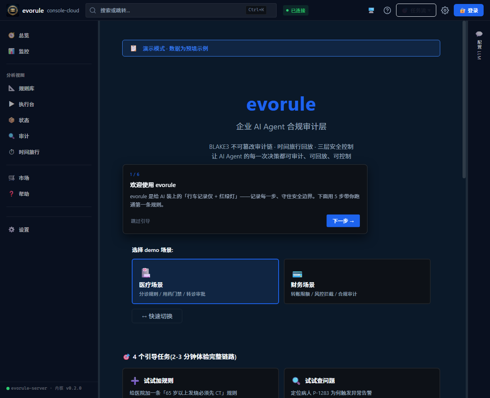
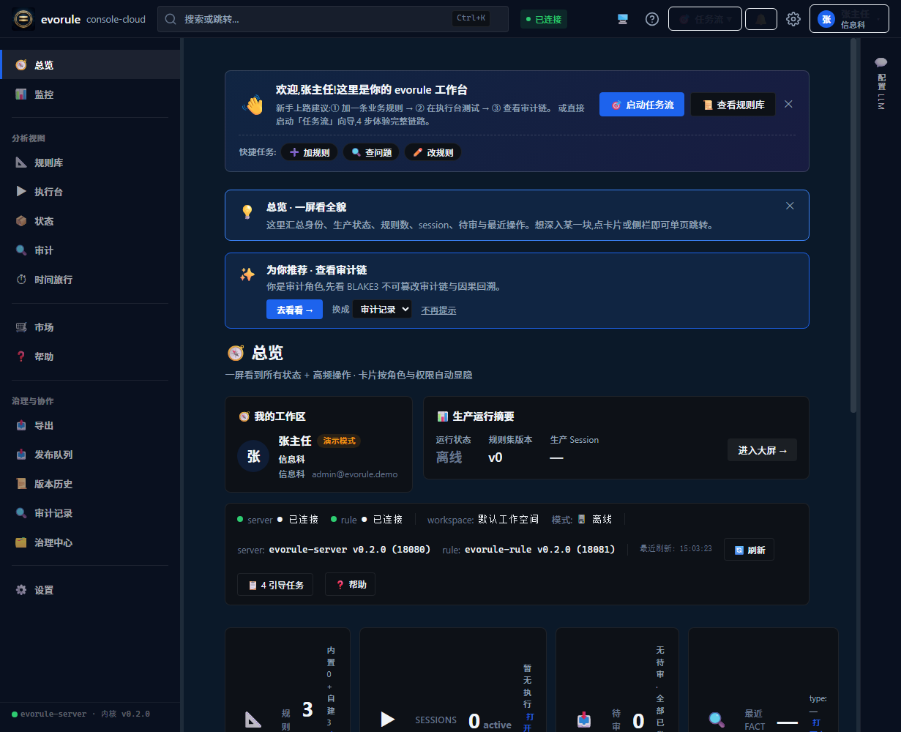
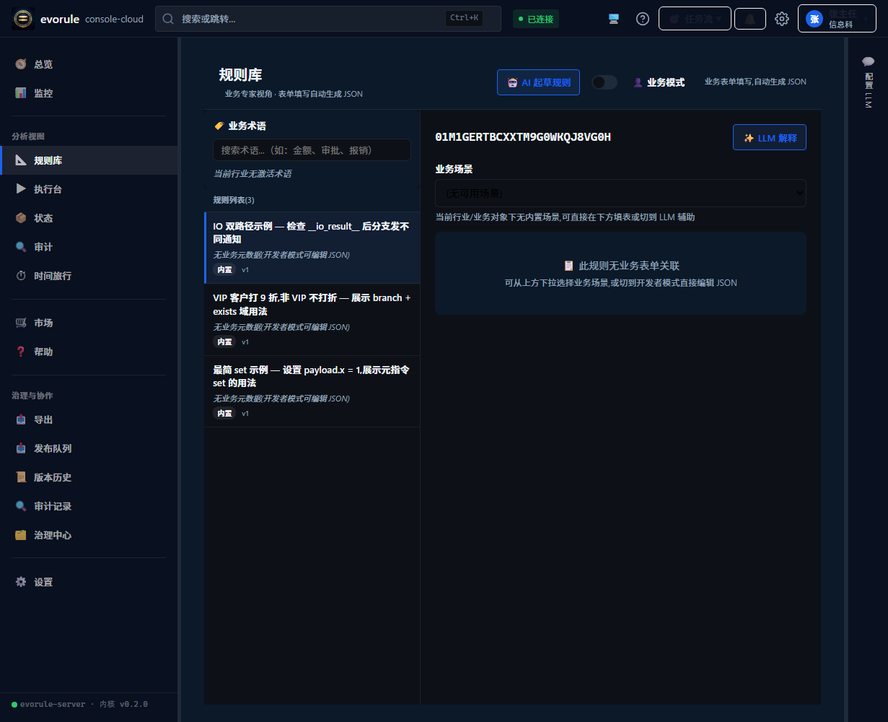
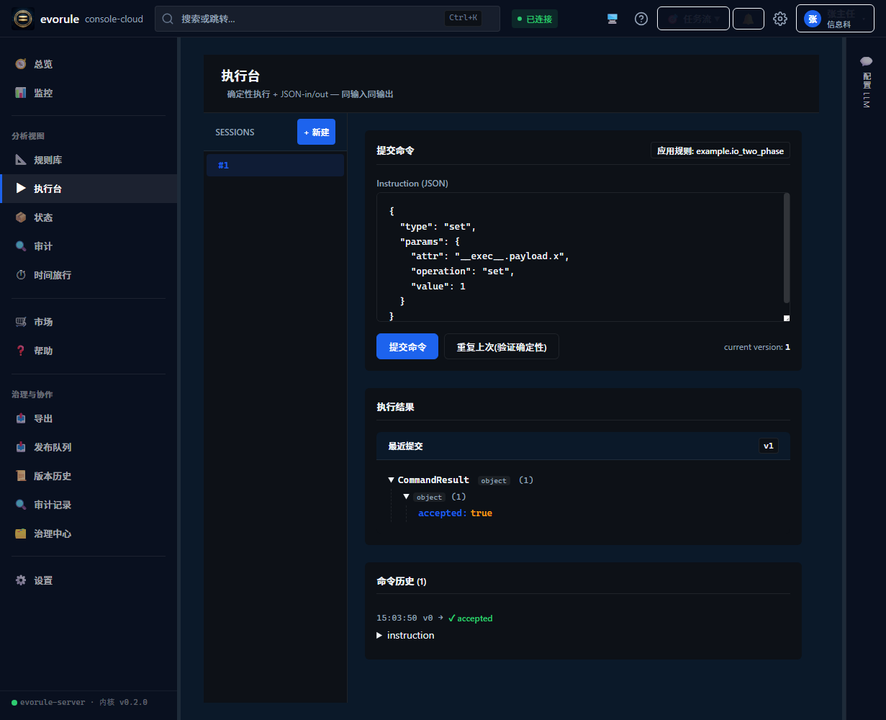
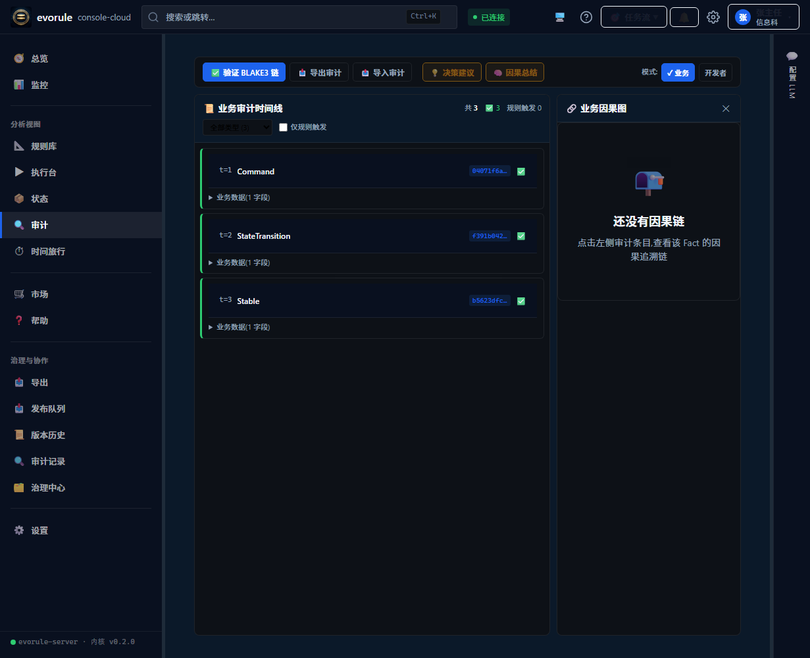
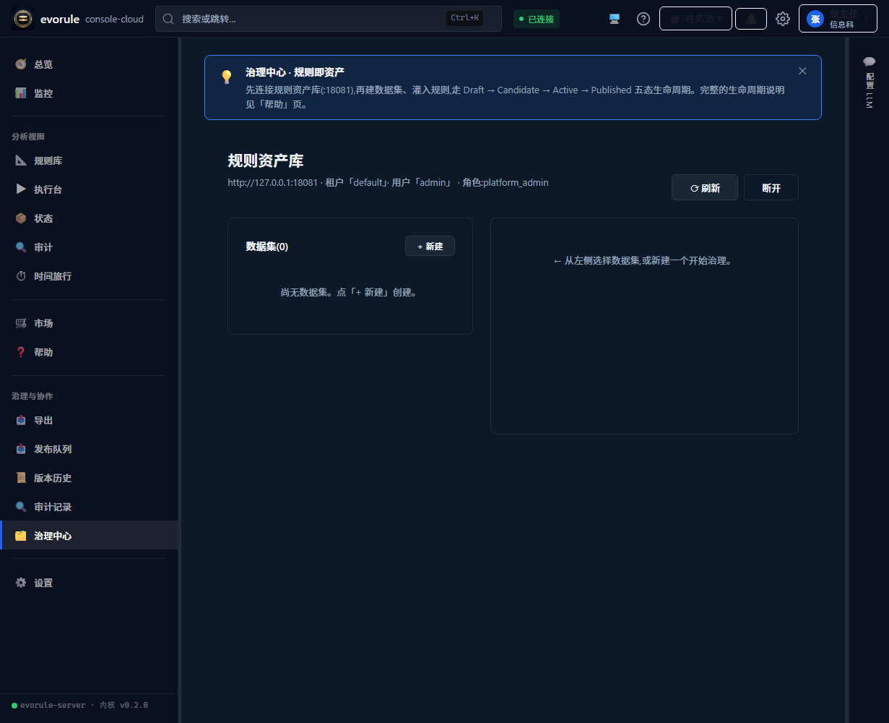

<!-- SPDX-License-Identifier: AGPL-3.0-or-later -->
<!-- Copyright (C) 2026 EvoRule Project -->

# 5 分钟跑起来（体验包路径）

> **目标**：从"下载压缩包"到"在审计页看到自己的事实链"，5 分钟内完成。
> 全程**不需要安装** Node / Rust / 数据库——解压即用。

本文走**体验包路径**（拿现成压缩包的普通用户视角）。如果你是开发者、想改代码跑 dev 环境，请走[开发者路径](./01-quickstart.md)。

---

## 第 0 步 · 下载体验包（1 分钟）

打开 [Gitee Releases](https://gitee.com/evorule/evorule-console-cloud/releases) 页，在最新版本（v0.2.0）的附件中下载：

| 附件 | 适合谁 |
| --- | --- |
| `evorule-console-cloud-v0.2.0-win64.zip` | Windows 10/11 64 位（本文路径） |
| `evorule-console-cloud-v0.2.0-linux64.tar.gz` | Linux x86_64（启动用 `sh start-evorule.sh`，其余步骤相同） |
| `evorule-bundle-v0.2.0-docker.tar` | 会用 Docker 的用户（`docker load` 后映射 18080/18081 端口运行，数据挂 `/data` 卷） |

> macOS 包规划中，当前提供 win64 / linux64 与 Docker 单镜像。

## 第 1 步 · 解压（10 秒）

把 zip 解压到**任意不含空格的目录**，例如 `D:\evorule\`。解压后根目录内容：

```
start-evorule.bat        ← 一键启动脚本（双击它）
evorule-server.exe       ← 主服务（运行时 :18080）
evorule-rule-serve.exe   ← 规则资产治理服务（:18081）
web\                     ← 前端页面
rules\                   ← 运行规则集
service_registry.json    ← 内置服务声明
resources\               ← 引擎宪法（core_eval）
README-STARTUP.txt       ← 完整使用说明（必读，含升级/换密钥）
```

## 第 2 步 · 双击 `start-evorule.bat`（10 秒）

双击后弹出两个最小化窗口（`evorule-server` 和 `evorule-rule`）——**关掉这两个窗口 = 停止服务**。

> 杀毒软件可能提示"未知发布者"：本包未做数字签名，选"仍要运行"即可。

## 第 3 步 · 浏览器自动打开首页

服务就绪后浏览器自动打开 `http://localhost:18080`，你会看到：



页面顶部已提示"**演示模式·数据为预置示例**"——体验包内置医疗 + 财务两套 demo 场景，零配置直接玩。

## 第 4 步 · 一键登录（10 秒）

点右上角「**登录**」→ 选择「**切换到演示模式**」→ 点选预置用户（如 **张主任·信息科**）进入工作台。

不需要注册、不需要输入密码——演示模式的账号、权限矩阵都是预置好的。

## 第 5 步 · 跟着引导任务走（2 分钟）

工作台首页就是「**新手引导**」，按顺序做 4 个引导任务即可体验完整链路：



1. **试试加规则**——给医院加一条「65 岁以上发烧必须先 CT」
2. **试试查问题**——定位病人 P-1283 为何触发异常告警
3. 后续两个任务（改规则 / 合规门禁）依次完成

每个任务都是表单式操作，照着填就行。

## 第 6 步 · 看一眼规则库

左侧栏「**规则库**」可以随时查看当前场景的全部规则（demo 预置 3 条：IO 双路径示例、VIP 折扣、最简 set 示例）：



## 第 7 步 · 执行台跑一条规则（1 分钟）

左侧栏「**执行台**」→「**新建**」会话 → 右上「**应用规则**」选一条规则 → 点「**提交命令**」：



下方「执行结果」出现 `CommandResult → accepted: true` 即执行成功。evorule 是确定性引擎：同一输入永远得到同一输出，可以点「重复上次(验证确定性)」亲自验证。

## 第 8 步 · 审计页看事实链（必看，这是 evorule 的灵魂）

左侧栏「**审计**」——你刚才的每一步操作都已变成**不可篡改的事实链**：



每条事实（Command / StateTransition / Stable）都带 BLAKE3 哈希并链接前一条，改任何历史记录都会被立刻发现。这就是"AI Agent 的行车记录仪"。

## 可选 · 治理中心（规则资产库）

左侧栏底部「**治理中心**」连接本地的规则资产治理服务（默认地址 `http://127.0.0.1:18081`，演示凭据 `admin` / `evorule-demo`）：



数据集管理、5 态生命周期、审批发布都在这里——正式资产治理的完整形态。

---

## 停止与重置

- **停止**：关掉任务栏上 `evorule-server` 和 `evorule-rule` 两个窗口
- **数据都在本机**：一切持久化在包内 `data\` 目录（SQLite + WAL），删除 `data\` 即完全重置
- **端口冲突 / 换凭据 / 升级换包**：见包内 `README-STARTUP.txt`（含正式部署前必读的默认凭据更换说明）

## 下一步

- 想理解刚才发生了什么 → [核心概念：规则即数据](../explanation/)
- 开发者，想改代码跑 dev 环境 → [5 分钟跑通第一条规则（开发者路径）](./01-quickstart.md)
- 想把 evorule 接进自己的系统 → [evorule-server 实战指南](https://gitee.com/evorule/evorule-server/blob/main/docs/INTEGRATION_GUIDE.md)

遇到问题欢迎提 [issue](https://gitee.com/evorule/evorule-console-cloud/issues)（尽力答复，不承诺响应时间）。
